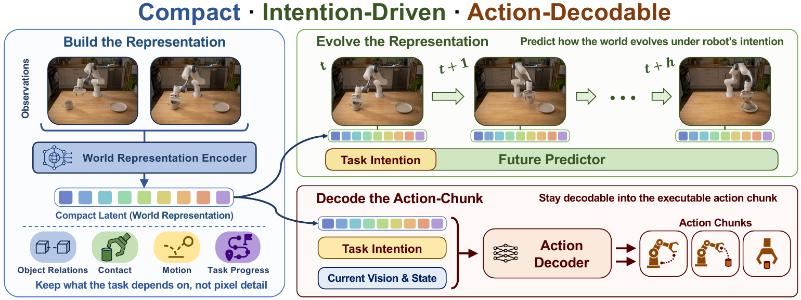
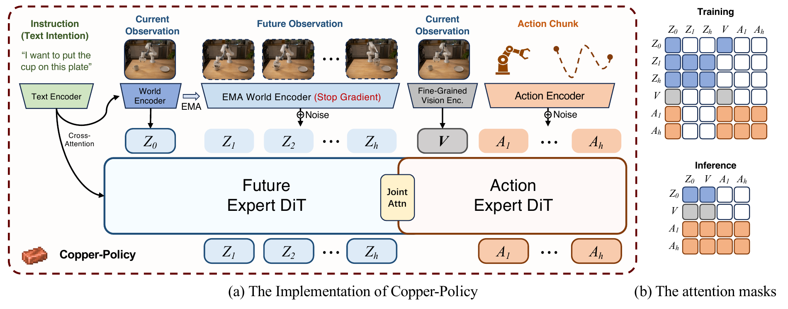

<div align="center">

<h1 align="center"> Copper-Policy</h1>

### Focus on the Representation for Robust Robot Manipulation

**Zexin Feng · Yixu Feng · Lingyu Xiao · Shang Su · Kexin Zheng**<br>
**Chang Xu · Mengkai Shi · Shuo Feng · Xintao Yan**

The University of Hong Kong · The University of Sydney · Tsinghua University · DenseAI

[English](README.md) | [中文](README_zh.md)

[](https://arxiv.org/abs/2609.32779)
[](https://zexinfeng-cn.github.io/works/copper-policy/)

**Cheap Training, Strong Control.**

</div>



## ✨ Overview

Copper-Policy jointly learns a compact world representation and a robot policy. Task-conditioned future embedding prediction shapes the representation, while current-frame visual features preserve spatial detail for action execution.

- **Compact world modeling:** predict future embeddings without reconstructing pixels.
- **Efficient learning:** a 2B model trained in 9.67 hours on 8 × RTX 5090 GPUs.
- **Robust manipulation:** evaluated on LIBERO, LIBERO-Plus, RoboTwin, and three real-robot tasks.

<div align="center">

| LIBERO | LIBERO-Plus | RoboTwin clean | RoboTwin randomized | Real robot |
| :---: | :---: | :---: | :---: | :---: |
| **97.25%** | **80.85%** | **70.84%** | **12.98%** | **96.3%** |

</div>

*Results reported in the [paper and project page](https://zexinfeng-cn.github.io/works/copper-policy/#main-result).*



## 📦 Release

- [x] Policy inference and benchmark evaluation
- [x] Encoder downloads and simulator setup
- [x] Real-robot policy server

### TODO

- [ ] **Training code — coming soon**
- [ ] Model checkpoints
- [ ] Datasets

[Installation](#-installation) · [Checkpoints](#-checkpoints) · [Evaluation](#-evaluation) · [Real Robot](#-real-robot) · [Citation](#-citation)

## 🛠️ Installation

**Requirements:** Linux x86_64, [uv](https://docs.astral.sh/uv/getting-started/installation/), an NVIDIA GPU, and ffmpeg. Python 3.10.16 and PyTorch 2.9.0 / CUDA 13.0 are pinned in `pyproject.toml` and `uv.lock`.

```bash
git clone https://github.com/mark4551124015/copper-policy.git
cd copper-policy
uv sync --frozen --all-extras --inexact
uv run --frozen --all-extras --no-sync python -m third_party.setup_sources all
```

Install the simulator assets below before evaluation. The launchers select LIBERO and LIBERO-Plus independently, so both source trees can coexist in `third_party/`.

<details>
<summary><b>LIBERO & LIBERO-Plus setup</b></summary>

The locked `libero` extra contains their Python dependencies. Sources are fetched by the command above; see the upstream [LIBERO](https://github.com/Lifelong-Robot-Learning/LIBERO) and [LIBERO-Plus](https://github.com/sylvestf/LIBERO-plus) installation guides for system requirements.

For LIBERO-Plus, install ImageMagick's shared library (Ubuntu: `sudo apt-get install libmagickwand-dev`) and download the additional assets:

```bash
uv run --frozen --all-extras --no-sync hf download Sylvest/LIBERO-plus assets.zip \
  --repo-type dataset --local-dir third_party/LIBERO-plus
unzip third_party/LIBERO-plus/assets.zip -d third_party/LIBERO-plus/libero/libero
```

</details>

<details>
<summary><b>RoboTwin setup</b></summary>

A CUDA 13.0 toolkit and C++ compiler are needed to build cuRobo. Set `CUDA_HOME` if the toolkit is outside `/usr/local/cuda`; `TORCH_CUDA_ARCH_LIST` should match your GPU.

```bash
# RTX 5090; set the architecture appropriately for other GPUs.
TORCH_CUDA_ARCH_LIST='12.0+PTX' uv run --frozen --all-extras --no-sync bash tools/setup_robotwin.sh
uv run --frozen --all-extras --no-sync bash -c \
  'cd third_party/RoboTwin && bash script/_download_assets.sh'
```

The setup uses SAPIEN 3.0.0b1, cuRobo v0.7.8 and RoboTwin revision `c3ddfa8b97d5519efa828b075999bd0006778e5e`. It also installs OIDN 2.3.3 for Blackwell rendering support. See the upstream [RoboTwin installation guide](https://robotwin-platform.github.io/doc/usage/robotwin-install.html).

**Keep `--inexact` when synchronizing the environment:** cuRobo is built separately, and an exact `uv sync` removes it. Rerun the setup after changing Python or PyTorch.

</details>

## 🤗 Checkpoints

### Pretrained encoders

Download all three encoder presets with one command:

```bash
uv run --frozen --all-extras --no-sync python -m tools.download_weights all --yes
```

Existing caches are reused. The downloader reports estimated storage and available disk space before fetching missing weights.

<div align="center">

| Encoder | Default preset | Source |
| --- | --- | --- |
| World | `vjepa2_1_vit_large_384` | [V-JEPA 2.1](https://github.com/facebookresearch/vjepa2) |
| Vision | `dinov2_with_registers_large` | [DINOv2](https://huggingface.co/facebook/dinov2-with-registers-large) |
| Text + tokenizer | `wan22_ti2v_5b` | [Wan 2.2](https://huggingface.co/Wan-AI/Wan2.2-TI2V-5B-Diffusers) |

</div>

<details>
<summary><b>Manual encoder downloads</b></summary>

```bash
WORLD_DIR=pretrained_weights/world_encoder/vjepa2_1_vit_large_384
mkdir -p "$WORLD_DIR"
git clone --depth 1 https://github.com/facebookresearch/vjepa2.git "$WORLD_DIR/source"
curl -fL --retry 3 -o "$WORLD_DIR/vjepa2_1_vitl_dist_vitG_384.pt" \
  https://dl.fbaipublicfiles.com/vjepa2/vjepa2_1_vitl_dist_vitG_384.pt

uv run --frozen --all-extras --no-sync hf download facebook/dinov2-with-registers-large \
  config.json model.safetensors \
  --local-dir pretrained_weights/vision_encoder/dinov2_with_registers_large

uv run --frozen --all-extras --no-sync hf download Wan-AI/Wan2.2-TI2V-5B-Diffusers \
  --include 'tokenizer/*' 'text_encoder/*' \
  --local-dir pretrained_weights/text_encoder/wan22_ti2v_5b
```

Encoder presets and cache locations are defined in `wan_va/modules/backbone_presets.py`. A replacement encoder must match the policy checkpoint.

</details>

### Copper-Policy weights

**Public download links are coming soon.** Place the inference checkpoints at:

<div align="center">

| Benchmark | Checkpoint path |
| --- | --- |
| LIBERO / LIBERO-Plus | `pretrained_weights/copper_policy/libero/policy.pt` |
| RoboTwin clean / randomized | `pretrained_weights/copper_policy/robotwin/policy.pt` |

</div>

LIBERO and LIBERO-Plus share one checkpoint. Each export contains policy parameters, the required model configuration, and normalization statistics. Inference uses the trained policy directly and needs no separate Wan transformer initialization weights.

## 🚀 Evaluation

### Run all four benchmarks

```bash
uv run --frozen --all-extras --no-sync bash run.sh \
  --out-dir outputs/evaluation/full_v1 \
  --gpu-ids 0,1,2,3,4,5,6,7
```

Runs **RoboTwin clean → LIBERO → RoboTwin randomized → LIBERO-Plus**, with compilation and rollout videos enabled.

<div align="center">

| Benchmark | Full coverage | Episodes per task / instance |
| --- | --- | :---: |
| RoboTwin clean | 50 tasks | 50 |
| LIBERO | 40 tasks across four suites | 50 |
| RoboTwin randomized | 50 tasks | 50 |
| LIBERO-Plus | 10,030 perturbed instances | 1 |

</div>

Resume the same run after interruption:

```bash
uv run --frozen --all-extras --no-sync bash run.sh \
  --out-dir outputs/evaluation/full_v1 \
  --gpu-ids 0,1,2,3,4,5,6,7 --resume
```

### Run one benchmark

```bash
uv run --frozen --all-extras --no-sync bash test_robotwin_clean.sh --all-tasks
uv run --frozen --all-extras --no-sync bash test_libero.sh --all-tasks
uv run --frozen --all-extras --no-sync bash test_robotwin_rand.sh --all-tasks
uv run --frozen --all-extras --no-sync bash test_libero_plus.sh --all-tasks
```

Set `EVAL_GPU_IDS=0` to use a single GPU. Set `OUT_DIR` to reuse an output directory and continue completed episodes. Without `--all-tasks`, the individual scripts use smaller task selections: 10 clean tasks, 6 randomized tasks, 10 LIBERO tasks, or 500 LIBERO-Plus instances.

<details>
<summary><b>Evaluation settings and outputs</b></summary>

<div align="center">

| Setting | RoboTwin | LIBERO / LIBERO-Plus |
| --- | :---: | :---: |
| Denoising steps | 10 | 10 |
| Replan steps | 24 | 10 |
| Inference seed | 0 | 7 |
| Compile | On | On |
| Video | On | On |

</div>

Each GPU keeps one policy, T5 and V-JEPA stack resident across tasks. LIBERO can run multiple environment clients per GPU with `MAX_TASKS_PER_GPU`; policy inference remains batch size 1. RoboTwin retains its expert check and evaluates accepted scenes.

Outputs include `summary.json`, task results, logs, and videos marked `succ` / `fail`. LIBERO-Plus's overall score is weighted by episodes. `all_tasks_completed` describes evaluation completion.

`--smoke` reduces episode counts; `--dry-run` previews commands. Use `--no-compile` on an individual launcher for eager inference. `run.sh --help` lists checkpoint, episode-count and inference-setting overrides.

</details>

<details>
<summary><b>Note: LIBERO language mapping</b></summary>

Language instructions in the LIBERO training dataset can differ from those provided by the evaluation benchmarks. We use an exact plaintext mapping from benchmark prompts to training instructions. **LIBERO-Plus language perturbations are not mapped** and retain their original benchmark prompts. Unmatched prompts also remain unchanged.

</details>

## 🤖 Real Robot

Launch the TCP policy server with your real-robot checkpoint:

```bash
uv run --frozen --all-extras --no-sync python wan_va/wan_va_server.py \
  --checkpoint /path/to/realrobot.pt \
  --t5-dir pretrained_weights/text_encoder/wan22_ti2v_5b \
  --host 127.0.0.1 --port 8767 --compile-infer-action 0
```

The server uses length-prefixed JSON requests. Model presets are in `inference/`; shared defaults are in `inference/config_base.json`.

## 📚 Citation

```bibtex
@misc{feng2026copperpolicyfocusrepresentationrobust,
  title={Copper-Policy: Focus on the Representation for Robust Robot Manipulation},
  author={Zexin Feng and Yixu Feng and Lingyu Xiao and Shang Su and Kexin Zheng and Chang Xu and Mengkai Shi and Shuo Feng and Xintao Yan},
  year={2026},
  eprint={2609.32779},
  archivePrefix={arXiv},
  primaryClass={cs.RO},
  url={https://arxiv.org/abs/2609.32779}
}
```

## 🙏 Acknowledgements

Our implementation builds on [FastWAM](https://github.com/yuantianyuan01/FastWAM) and [LingBot-VA](https://github.com/robbyant/lingbot-va). We thank their authors and the teams behind V-JEPA, DINOv2, Wan, LIBERO, LIBERO-Plus, and RoboTwin for sharing their work.

Dataset conversion to LMDB uses our [lerobot-tools](https://github.com/Mark4551124015/lerobot-tools).

We also thank Codex for helping organize the code for this open-source release.

## 📄 License

This code is released under [Apache 2.0](LICENSE). External models, simulators, and assets retain their respective licenses.
